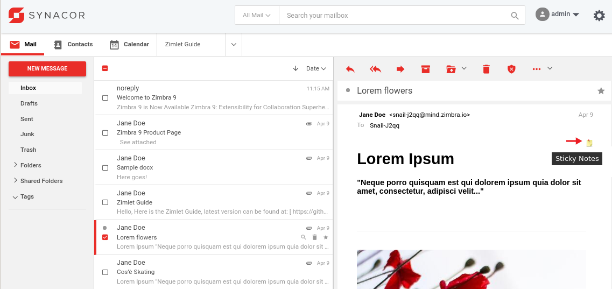
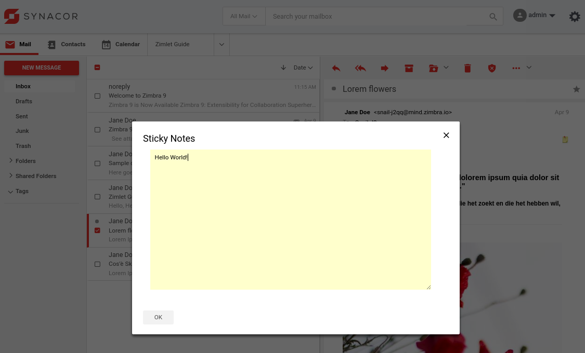
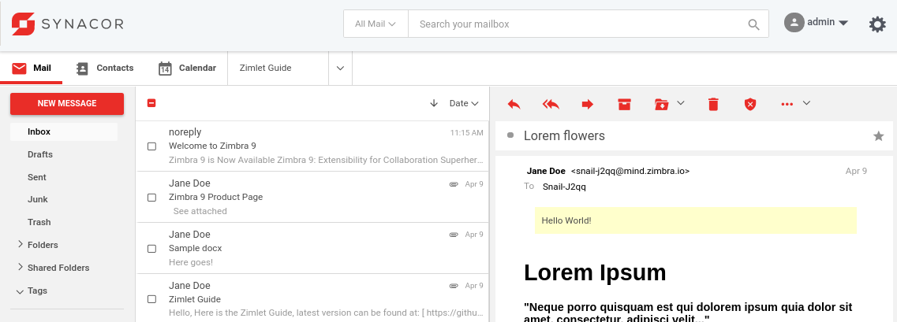

# Zimlet internationalization and custom metadata

This article explains how to use internationalization and custom metadata in Modern UI/Preact Zimlets for Zimbra. If you are new to Zimlets please take a look at the previous article at https://github.com/Zimbra/zm-zimlet-guide.

## Prerequisites 

To follow the steps in this article you need a Zimbra test server. You will need to have Zimbra 9 Network Edition patch 3. You can set this up in a Virtual Machine in the cloud or you can install it on your local computer inside VirtualBox/KVM/Parallels etc. If you decide to set it up on your local computer you need at least an i5 with 16GB of RAM and a SSD. Your test server needs to be accessible over SSH. Instructions on how to set up your Zimbra server: https://blog.zimbra.com/2018/01/install-zimbra-collaboration-8-8-ubuntu-16-04-lts/ make sure to install the latest patches. You can find instructions on how to install patches at https://wiki.zimbra.com/wiki/Zimbra_Releases

## What is custom metadata?

Custom metadata is additional information that you can add to emails, contacts, calendar etc in Zimbra. This custom metadata is stored in MariaDB. Adding additional information to items can be useful when your are extending Zimbra. Custom metadata can be accessed via the Zimlet framework on all versions of Zimbra. This makes it possible to use metadata in the modern and classic UI seamlessly. You can also use soap to get and set custom metadata.

This article shows you an example Zimlet that allows the user to add Sticky Notes to emails in Zimbra.

## What is internationalization?

You probably already know this, but Zimbra is available in many languages. This article explains how to support multiple languages in your Zimlet.

## Deploy the Zimlet Sideloader

You need to deploy and enable the Zimlet Sideloader on your development server. You only have to do this step once. 

      yum install zimbra-zimlet-sideloader
      apt install zimbra-zimlet-sideloader
      su - zimbra
      zmmailboxdctl restart


*Verify that the Sideloader Zimlet is available and enabled for your Zimbra Class of Service (CoS) by logging into the Admin UI -> Home -> Configure -> Class of Service.*


*Verify that the Sideloader Zimlet is available and enabled for your Zimbra and account by logging into the Admin UI -> Home -> Manage -> Accounts.*

## Installing Zimlet CLI

You can develop Zimbra Zimlets on any OS supported by NodeJS (https://nodejs.org/en/download/). This article will include Linux commands you can run on CentOS/Fedora/Redhat and Ubuntu. If you run on a different OS reading these commands should help you understand what you must do to get started. 

Zimbra provides a tool called Zimlet CLI that is based on Webpack. It is used for building/packaging your Zimlet and for working with Zimlet templates. Install it on your local computer:

As root:

      yum install nodejs
      apt install nodejs
      npm install -g @zimbra/zimlet-cli


## Downloading and running the Sticky Notes Zimlet

Create a folder on your local computer to store the Sticky Notes Zimlet:

      mkdir ~/zimbra_course_pt3
      cd ~/zimbra_course_pt3
      git clone https://github.com/Zimbra/zimbra-zimlet-sticky-notes
      cd zimbra-zimlet-sticky-notes
      npm install
      zimlet watch

The output of this command should be:

```
Compiled successfully!

You can view the application in browser.

Local:            https://localhost:8081/index.js
On Your Network:  https://192.168.1.100:8081/index.js
```

Visit https://localhost:8081/index.js in your browser and accept the self-signed certificate. The index.js is a packed version of the `Sticky Notes Zimlet`. More information about the zimlet command, npm and using SSL certificates can be found in https://github.com/Zimbra/zm-zimlet-guide. 

## Sideload the Sticky Notes Zimlet

Log on to your Zimbra development server and make sure that you are seeing the modern UI. Then append `/sdk/zimlets` to the URL.

> 
*Sideload the Sticky Notes Zimlet by clicking Load Zimlet. The Zimlet is now added to the Zimbra UI in real-time. No reload is necessary.*

> 
*Click the Sticky Note icon that now shows up in the right top of the displayed email.*

> 
*Make a note, and click OK.*

> 
*The Sticky Note is now displayed when viewing the email, to edit the note, click it.*

## Visual Studio Code

Open the folder `~/zimbra_course_pt3/zimbra-zimlet-sticky-notes` in Visual Studio code to take a look at the code in the Sticky Notes Zimlet. More information on this can be found at: https://github.com/Zimbra/zm-zimlet-guide.

## Internationalization (i18n)

To make your Zimlet available in multiple languages, you can use `preact-i18n`. It is set up using json files and an enhancer.js. Take a look at the following files:

* ~/zimbra_course_pt3/zimbra-zimlet-sticky-notes/src/intl/en_US.json
* ~/zimbra_course_pt3/zimbra-zimlet-sticky-notes/src/enhancers.js

The contents of enhancers.js is similar across all Zimlets:

```javascript
import { withIntlWrapper } from '@zimbra-client/enhancers';

/**
 * @method withIntlWrapper
 * accepts three arguments which can be use to load zimlet locale.
 * @param {Object} - with following values
 * @param {Function} importFn which returns `import` with intl locale path of the zimlet.
 * @param {Boolean} showLoader Show loader on container or not
 *
 */
export const withIntl = () => withIntlWrapper(
    {
        importFn: locale => import(/* webpackMode: "eager" */`./intl/${locale}.json`),
        showLoader: false
    }
);
```

In src/intl you have to provide JSON formatted language strings for all languages you wish to support and add them to `.eslintrc.js`. But at least you must always provide `en_US.json` as the default fallback language. Example content:

```javascript
{
   "zimbra-zimlet-sticky-notes": {
      "title": "Sticky Notes"
      }
}
```


Now to make use of the `title` string in a Preact Component you have to load it like so:

```javascript
import { createElement, Component } from 'preact';
import { withIntl } from '../../enhancers';
import { withText } from 'preact-i18n';

@withIntl()
@withText({
    title: 'zimbra-zimlet-sticky-notes.title',
})
export default class MyComponent extends Component {

   render() {
      const { title } = this.props;
      return (<div>{title}</div>);
   }
}
```      

Now this component will return the string `Sticky Notes`.

ESLint is a code analysis tool for identifying problems in JavaScript code. If you add more languages files, those should be added to .eslintrc.js. Example config:

```javascript
...
"preact-i18n": {
   "languageFiles": [
      {
         "name": "en_US",
         "path": "src/intl/en_US.json"
      }
   ],
...
```

## Reading and writing custom metadata

If you want to set custom metadata for an item so you can do it by using withSetCustomMetaData and withGetCustomMetaData decorators. These decorators are using [SetCustomMetadata](https://files.zimbra.com/docs/soap_api/8.8.15/api-reference/zimbraMail/SetCustomMetadata.html) and [GetCustomMetadata](https://files.zimbra.com/docs/soap_api/8.8.15/api-reference/zimbraMail/GetCustomMetadata.html) SOAP API and has client side GraphQL implementation.

### Use of withSetCustomMetaData decorator in a Component

When you add an empty `@withSetCustomMetaData()` decorator a setCustomMetadata method will be passed in the props of your component.

```js
import { withSetCustomMetaData } from '@zimbra-client/graphql';

@withSetCustomMetaData() 
export default class Display extends Component {

    handleClick = e => {
        this.props.setCustomMetadata({
            id: this.props.emailData.id, // id of any appointment, mail or contact item on which we want to set metadata
            section: "zwc:stikyNotesZimletMetaData", // <sectionName> can be replaced with any string, it is recommended to use zimlet name, like zwc:slackZimlet
            attrs: [
                {
                    key: "meta",
                    value: "here goes the content of the metadata..."
                },
            ]
        });
    }    
    
	render() {
		return (
			<button onClick={this.handleClick} />
		)
	}
}

```

### Use of withGetCustomMetaData decorator with a Component

Use `withGetCustomMetaData` decorator which trigger SetCustomMetadataRequest to get defined custom meta with an item.

```js
import { withGetCustomMetaData } from '@zimbra-client/graphql';

@withGetCustomMetaData({
    id: "1234" // id of any appointment, mail or contact item from which we want to get metadata
    section: "zwc:<sectionName>" // <sectionName> can be replaced with any string, it is recommended to use zimlet name, like zwc:slackZimlet
}, ({ data: { getCustomMetadata } }) => {
    const customMetaInfo = get(getCustomMetadata, 'meta.0._attrs');
    return {
        customMetaInfo
    }
})
```

### Get Custom Meta Data using Query component from react-apollo

This is an alternative way to get custom metadata that uses the Query component from react-apollo. You can pass variables to the Query component without the need for additional wrapper components and it can be used directly in the render method so you can display the contents of the metadata in a Zimlet slot.

```js
import { createElement, Component } from 'preact';
import { Query } from 'react-apollo';
import gql from 'graphql-tag';
import { Spinner } from '@zimbra-client/blocks';
export default class Display extends Component {

    constructor(props) {
        super(props);

        this.note = gql`
        query GetCustomMetadata($id: ID!, $section: String!) {
            getCustomMetadata(id: $id, section: $section) {
               meta {
                  section
                  _attrs {
                     key
                     value
                  }
               }
            }
         }
         `;
    };

    render() {
        //this.props.emailData.id is passed from the Zimlet Slot
        return (
            <Query query={this.note} variables={{ id: this.props.emailData.id, section: "zwc:stikyNotesZimletMetaData" }}>
                {({ loading, error, data }) => {
                    if (loading) return <Spinner class={style.spinner} />;
                    if (error) return "";
                    if (data.getCustomMetadata.meta && data.getCustomMetadata.meta[0]._attrs[0].value !== "") {
                        return (
                            <div>{data.getCustomMetadata.meta[0]._attrs[0].value || ""}</div>
                        );
                    } else {
                        return (
                            <div>No metadata</div>
                        );
                    }
                }}
            </Query>
        );
    }
}
```


## Further reading

- [Custom Meta Data in the Classic UI](https://github.com/Zimbra-Community/com_zimbra_stickynotes/blob/master/com_zimbra_stickynotes/stickynotes.js)
- [Zimlet CLI wiki](https://github.com/Zimbra/zimlet-cli/wiki/Storing-and-Fetching-MetaData-in-Zimlets)
